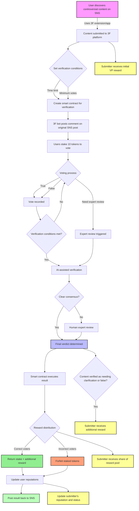

## 1. Executive Summary

3F (Vote For Fact) is a decentralized fact-checking platform built on the Kaia blockchain. It aims to combat misinformation by leveraging collective intelligence, blockchain technology, and economic incentives. The platform introduces a unique dual-token system and a reputation-based voting mechanism to ensure accurate and reliable fact-checking.

## 2. Product Overview

3F consists of the following key components:

1. **Decentralized Fact-Checking System**: Allows users to submit and verify news articles or claims.
2. **Dual-Token Economy**: Utilizes TruthCoin (TC) and VerifyPoint (VP) for different platform activities.
3. **Reputation System**: Tracks user reliability and influences voting power.
4. **Educational Module**: Improves media literacy among users.
5. **Community Governance**: Enables token holders to participate in platform decisions.

## 3. Detailed Product Flow

### 3.1 Content Discovery and Submission

1. **Browser Extension and Mobile App**:
   - Users install the 3F browser extension or mobile app.
   - These tools integrate with major social media platforms (SNS) like Facebook, X, Thread, Instagram, etc.

2. **Content Flagging**:
   - When a user encounters a controversial news article or claim on SNS, they can easily flag it using the 3F extension/app.
   - The user sets verification conditions (e.g., time limit, minimum number of votes) or opts for decentralized verification.

3. **Content Submission to 3F Platform**:
   - Flagged content is automatically submitted to the 3F platform.
   - A smart contract is created to manage the verification process based on the set conditions.

4. **SNS Interaction**:
   - Upon submission, a 3F bot posts a comment on the original SNS post.
   - The comment informs others that a fact-check has been initiated and invites them to participate on the 3F platform.

### 3.2 Voting Process

1. **Voter Participation**:
   - Users can access the voting page through the SNS bot comment or directly on the 3F platform.

2. **Staking Mechanism**:
   - To vote, users must stake 10 3F tokens (fixed price per vote).
   - A token locking mechanism prevents users from transferring or selling staked tokens during the voting period.

3. **Voting Options**:
   - Users can vote "True," "False," or "Need Expert Review."

4. **Time-Weighted Voting**:
   - Early voters may receive higher rewards, incentivizing quick responses to misinformation.

### 3.3 Verification Process

1. **AI-Assisted Verification**:
   - An open-source AI model, running on Kaia's service chain, processes the content and votes.
   - The AI considers factors like vote distribution, user reputations, and content analysis.

2. **Expert Review** (if necessary):
   - For complex or contentious cases, or if "Need Expert Review" receives significant votes, human experts are engaged.
   - Experts are randomly selected based on their credentials and reputation.

3. **Verification Completion**:
   - The verification process concludes when preset conditions are met (e.g., time limit reached, sufficient votes collected).

### 3.4 Result Determination and Reward Distribution

1. **Final Verdict**:
   - The system combines AI analysis, community votes, and expert opinions (if applicable) to reach a final verdict.

2. **Smart Contract Execution**:
   - A Kaia-based smart contract automatically processes the results.

3. **Reward Distribution**:
   - Correct voters receive their staked tokens back plus a share of the reward pool.
   - Incorrect voters forfeit their staked tokens, which are added to the reward pool.

4. **Dynamic Reward Pool**:
   - The reward amount is adjusted based on factors like participation level and verification difficulty.

### 3.5 Reputation System

1. **Reputation Scoring**:
   - Users earn reputation points based on their voting accuracy and participation frequency.

2. **Reputation Benefits**:
   - Higher reputation users may receive additional rewards or have more weight in future votes.

### 3.6 Oracle Integration

1. **Cross-Platform Data Flow**:
   - Kaia's Oracle services facilitate secure data exchange between SNS platforms and the 3F system.

2. **Real-time Updates**:
   - Verification results are posted back to the original SNS content, providing real-time fact-checking information to the wider audience.

### 3.7 Community Contribution

1. **AI Model Improvement**:
   - The community can contribute to improving the open-source AI verification models.

2. **Governance Participation**:
   - Token holders can propose and vote on system improvements and parameter adjustments.

This detailed flow encompasses the entire process from content discovery on social media to the final reward distribution, incorporating both the initial concept and the technical implementation suggestions. It leverages Kaia blockchain's features like smart contracts, oracles, and service chains to create a robust, transparent, and efficient fact-checking ecosystem.

## 4. Economic Model

### 4.1 Dual-Token System

## 4.1.1 TruthCoin (TC)

- **Purpose**: Governance, high-stakes voting, value storage
- **Total Supply**: 1,000,000,000 TC
- **Distribution**:
    - 40% Public Sale
    - 25% Team and Advisors (4-year vesting)
    - 20% Community Rewards
    - 10% Foundation Reserve
    - 5% Early Investors (1-year lock-up)
- **Utility**:
    - Governance voting
    - High-stakes fact-checking
    - Staking for passive income
    - Accessing premium features

## 4.1.2 VerifyPoint (VP)

- **Purpose**: Daily platform activities, learning rewards
- **Supply**: Dynamic, algorithmically adjusted
- **Utility**:
    - Low-stakes fact-checking
    - Earning from educational activities
    - Micro-tasks and content submission

### 4.2 Token Interaction

- TC can be converted to VP at any time (dynamic rate)
- VP to TC conversion is restricted (minimum reputation required, conversion limits)

### 4.3 Economic Sustainability

- TC has a 2% annual inflation rate for the first 5 years
- VP supply is dynamically adjusted based on platform activity
- Transaction fees and incorrect vote penalties are used for token burns and reward pools

### 4.4 Incentive Alignment

- Staking mechanism ensures users have skin in the game
- Reputation system rewards consistent, accurate participation
- Long-term TC holding is incentivized through governance rights and fee sharing

## 5. Use Cases

### 5.1 Individual User: Maria, Student

Maria is a college student interested in current events but often unsure about the reliability of news she reads online.

1. Maria signs up for 3F and completes the onboarding process, receiving a small amount of VP.
2. She takes several media literacy courses on 3F, earning more VP and increasing her reputation.
3. Maria starts participating in low-stakes fact-checking using her VP.
4. As her accuracy and reputation grow, she earns more VP and converts some to TC.
5. With her TC, Maria now participates in high-stakes fact-checking of major news stories.
6. She also uses her TC to vote on platform governance issues, feeling more engaged with the community.

Outcome: Maria becomes a more discerning news consumer, earns crypto while learning, and actively contributes to combating misinformation.

### 5.2 News Organization: TruthSeeker News

TruthSeeker News is a digital news outlet looking to increase reader trust and engagement.

1. TruthSeeker integrates 3F's API into their website.
2. They submit all their published articles to 3F for community fact-checking.
3. Articles display a 3F verification badge, showing real-time community trust scores.
4. TruthSeeker encourages readers to participate in 3F verification, increasing engagement.
5. They use 3F analytics to identify trending topics and potential misinformation in their industry.
6. TruthSeeker's reputation for accuracy grows, attracting more readers and advertisers.

Outcome: TruthSeeker News enhances its credibility, engages readers in the fact-checking process, and gains valuable insights into news trends and reader concerns.

These use cases demonstrate how 3F can benefit both individual users and organizations, creating a more informed and engaged community while combating the spread of misinformation.